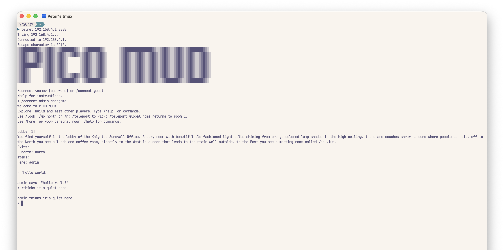

# PICO MUD



## About

PICO MUD is a lightweight, text-based multiplayer online game for the Raspberry Pi Pico 2 W. On boot, the Pico creates a WPA2-protected Wi-Fi hotspot and runs a telnet server. Players join the hotspot and connect to the game at `192.168.4.1:8888`.

Guests can explore public rooms and interact with items. Registered players can build rooms, exits, and items, send mail, and chat with other players. The game stores its world data on the Pico.

The MicroPython application is in `target/`. Its contents become the filesystem root of the Pico.

## Installation

### Requirements

- Raspberry Pi Pico 2 W
- MicroPython for the Pico 2 W (verified with MicroPython 1.29.0)
- A USB data cable
- [`mpremote`](https://docs.micropython.org/en/latest/reference/mpremote.html) or `uvx mpremote`
- A telnet client

Before the first boot, review `target/config.py`. Change `AP_PASSWORD`, `ADMIN_NAME`, `ADMIN_PASSWORD`, and `PASSWORD_SALT` when running a private MUD. The defaults are public, and changing the salt after first boot invalidates existing password hashes.

Connect the Pico by USB, identify its serial port, then upload the application:

```sh
uvx mpremote connect list
uvx mpremote connect <serial-port> fs cp -r target/models target/modules target/controllers target/views target/main.py :
uvx mpremote connect <serial-port> reset
```

Copy `target/config.py` separately after comparing it with the configuration already on the device. Do not overwrite the Pico's `/data` directory, which holds the saved world.

After restarting the Pico, join the configured Wi-Fi network, then connect:

```sh
telnet 192.168.4.1 8888
```

Some telnet clients perform DNS lookups and negotiate telnet capabilities when connecting. This may take 15-20 seconds; after the connection is established, the rest of the session should be responsive.

Use `/connect admin changeme` for the default administrator, or `/connect guest` to explore without an account.

## Commands

Every command begins with `/` and is case-insensitive. Plain text is sent to the current room as `/say`; `"text` and `:text` are shortcuts for saying and emoting. Use `/help` to choose a focused topic: `tutorial`, `user`, `movement`, `building`, or `programming`. Administrators also see `/help admin`.

| Command | Description |
| --- | --- |
| `/connect guest` | Enter as an anonymous guest. |
| `/connect <name>` | Log in and enter the password at the next prompt. |
| `/help [topic\|command]` | Choose focused help or show detailed syntax for one command. |
| `/look` | Show the current room, its exits, items, creatures, and players. |
| `/go <direction>` | Take an exit. Short forms such as `/n` and `/s` work. |
| `/who` | List connected players. |
| `/say <text>` | Speak to everyone in the current room. |
| `/emote <text>` | Perform an action in the current room. |
| `/whisper <player> <text>` | Send a private message to a player in the same room. |
| `/page <player> <text>` | Send a private message to any connected player. |
| `/mail` | List your mail. |
| `/mail send <user> <title> = <message>` | Send mail to a registered user. |
| `/dig <direction> <room name>` | Create a connected room you own. |
| `/create <item name>` | Create an item in a room you own. |
| `/creature <item> [on\|off]` | Classify an item as a creature. |
| `/habit add <item> <seconds> <name>` | Add timed activity to an item or creature. |
| `/habit edit <item> <id> <field> <value>` | Edit a habit's interval, name, chat, or emote. |
| `/habits <item>` | List an item's timed activity. |
| `/interaction add <item> <action> <text>` | Add an action to an item. |
| `/user create <name> <password>` | Create a user. Administrator only. |
| `/save` | Save changed world data immediately. Administrator only. |
| `/quit` | Disconnect from the MUD. |

### Moving Around

Guests and registered players can explore public rooms with `/go north` or the
short form `/n`. Use `/join <player>` to visit an online player when their room
is accessible. `/teleport to <room_id>` goes directly to a known room, while
`/teleport global home` returns to room 1. Registered players can use `/home`
to return to their own home room; guests do not have a personal home.

### Building And Exploring Rooms

Registered players can build only in rooms they own. Start with `/dig north
"green garden"` to create a connected room, then use `/n` to enter it. Give the
room a useful name and description with `/rename here "The Green Garden"` and
`/describe here A quiet place to rest.`. The opposite exit is created with the
new room, so `/s` returns to the original room.

### Creating Items And Actions

In a room you own, create scenery with `/create "brass lever"`. Add an action
that only shows a message with `/interaction add "brass lever" pull The floor
creaks.`; any visitor can then use `/pull "brass lever"`. Add a separate portal
action with `/interaction add "brass lever" enter You step through the gate.`,
then set its destination with `/interaction teleport "brass lever" enter
<room_id>`. Item teleportation can target one of your rooms or another owner's
public room, which lets portal items connect two public properties. It cannot
target another owner's private room.

### Creating Creatures And Habits

Creatures are items with a special room display and the same actions as ordinary
items. Create an item, then mark it with `/creature "garden sprite" on`; visitors
can still use its interactions. Give it timed behavior with `/habit add "garden
sprite" 30 hum`, then configure output with `/habit edit "garden sprite" 1
emote on hums softly.`. Use `/habits "garden sprite"` to review its activity.
Habits run only while at least one player is in the room.

## Variables For Builders

Variables let builders give each player temporary progress through a room, item,
creature, interaction, or habit. They work well for keys, switches, disguises,
counters, blessings, and other small pieces of story state.

Variables are session state, not world state. A player's values disappear when
they disconnect or when the Pico restarts. A value is also scoped to the owner of
the room content that reads or changes it. If two builders both use `has_key`,
their values do not collide. Guests receive their own temporary values too. Each
player can hold up to six variables for each content owner.

### Names And Values

Variable names are lowercase identifiers between 1 and 15 characters. They must
start with a letter and may contain letters, digits, and single underscores. For
example, `has_key`, `door2_open`, and `mood` are valid; `HasKey`, `_key`,
`has__key`, and `has_key_` are not. Player-facing output turns underscores into
spaces, so `has_blue_key` appears as `Has blue key`.

A stored value is either an integer from `0` through `100` or a non-empty string
of up to 15 characters. Unquoted integers are numeric. Quote strings, including
numeric-looking strings such as `"01"`:

```text
/interaction set "brass key" take has_key 1
/interaction set console enter access_code "01"
```

Numeric effects are changes rather than assignments. The first command adds `1`
to `has_key`; repeating it keeps adding until the result reaches `100`. Negative
values subtract, and the result never drops below `0`. String effects replace
the existing value. Players see a value when an effect changes it and can inspect
their current values with:

```text
/look at self
```

### Conditions

A condition consists of a variable, an operator, and a target value:

```text
<variable> <equals|more_than|less_than> <value>
```

Every condition configured on one room, item, or action must pass. `more_than`
and `less_than` require numeric values on both sides. A missing variable never
satisfies a condition.

```text
has_key equals 1
ward more_than 20
access_code equals "01"
```

### Rooms, Items, And Actions

Room unlock rules apply to the destination room. They are checked when a player
walks, teleports, joins another player, or uses an item portal. An unavailable
destination remains visible through its source exit, but entry is refused.

```text
/room-unlock-rules add has_key equals 1
/room-unlock-rules remove has_key equals 1
/room-unlock-rules clear
```

Global home (room `1`) and every personal home are permanently public and cannot
have room unlock rules. Items and creatures inside home rooms may still be
hidden, conditional, or apply effects.

Item visibility rules hide an item or creature entirely. Action requirements hide
only the selected action, so an item can remain visible while offering different
actions to different players.

```text
/item set "hidden door" visible add has_key equals 1
/item set "hidden door" visible remove has_key equals 1
/item set "hidden door" visible clear

/interaction require "stone altar" pray add blessing more_than 0
/interaction require "stone altar" pray clear
```

An interaction effect changes a value when the action runs. Effects happen before
an optional portal move.

```text
/interaction set "brass key" take has_key 1
/interaction set "rune panel" enter access_code "moon"
/interaction clear "rune panel" enter
```

### Habits And Effects

A habit can apply an effect independently to every player in its room whenever
it runs. Habits run only while the room is occupied. This makes them useful for
a healing fountain, a bard's song, a cursed fire, or any other timed room effect.

```text
/habit add "healing fountain" 30 restore
/habit set "healing fountain" 1 blessing 5
/habit clear "healing fountain" 1
```

The example adds `5` to each occupant's `blessing` every 30 seconds, up to `100`.

### Access And Bypasses

Room owners and administrators bypass room, item, creature, and action conditions
for content owned by that room's owner. They still receive configured effects when
they use an action or occupy a room with an active habit. Administrators can edit
variable metadata in any room, but cannot directly set another player's live
values.

Conditions never override ordinary access rules. Private rooms still admit only
their owner and administrators, locked exits block everyone, and portals still
require their destination to be accessible.

### Example: A Hidden Vault

Create a key whose action gives each player their own `has_key` value:

```text
/create "iron key"
/interaction add "iron key" take You take note of the key's weight.
/interaction set "iron key" take has_key 1
```

Hide a vault door until the player has a key, then require the same value to
enter the vault:

```text
/create "vault door"
/item set "vault door" visible add has_key more_than 0
/room-unlock-rules add has_key more_than 0
```

The rules apply only to the room owner's variable scope. Finding another
builder's key does not satisfy this vault's `has_key` condition.
